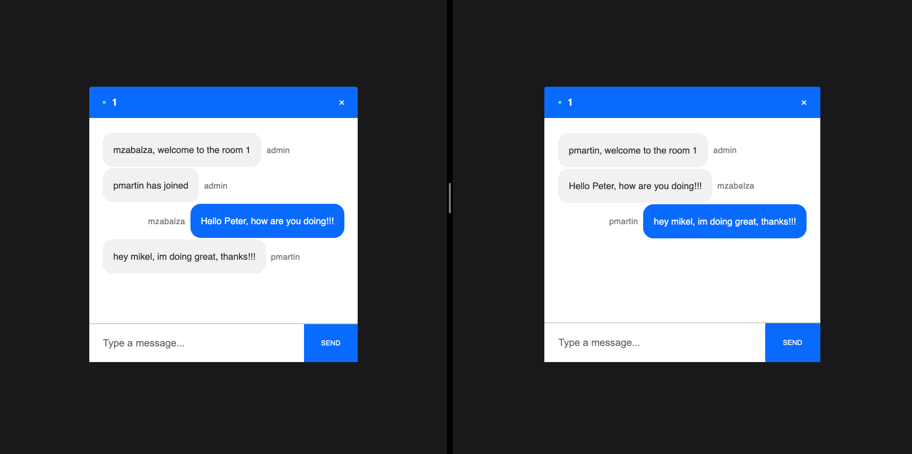

# CHAT APP
[Work in progress...]

<p align="center"></p>

Chat app created with node.js

## Table of contents
* [General info](#general-info)
* [Technologies](#technologies)
* [Setup](#setup)
* [Inspiration](#inspiration)


## Technologies
Project is created with:
* express: 4.17.1
* mustache: 4.0.0
* socket.io: 2.3.0

## Setup
To run this project, install it locally using npm:

```
$ cd ../<project-name>
$ npm install
$ npm start
```

Open browser and navigate to the default port used by ReactJS development server: http://localhost:3000
